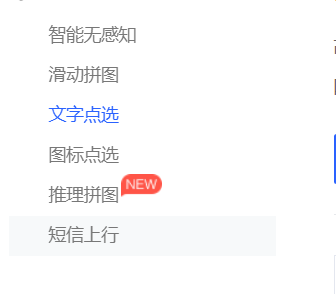

## 网页中几种常见验证码(介绍+技术)

### 1.1 问题分析

### 1.2 核心问题讲解

作用：

1  验证码是目前大多网站所支持并使用于注册登录的。就在于其作用能有效**防止恶意登录注册**，验证码每次都不同,

这就可以排除,用其他病毒或者软件自动申请用户及自动登陆.有效防止这种问题。

2  短信验证码等可以验证用户的合法性

### 1.3 问题扩展

   这些功能怎么做呢？

​     1 智能选图  文字点选   短信  滑动 等一般  都是购买的服务

​     2 图片文字验证码  这个 后台可以做 比如 php  java等  当然也可以去购买

 总之：他和后端关系很大  基本 对于前端来说  就是  发送ajax 就行

### 1.4  结合项目中使用

 比如 短信  聚合  <https://www.juhe.cn/>

​         1 前端 点击发送验证码  提交手机 到后台 

​          2  后台 拿到前端发来的手机  调用购买的  短信接口 就可以发送验证码到手机上了

   比如 滑动验证码 极验  [文档]( https://www.geetest.com/Sensebot?utm_campaign=sem%E8%A1%8C%E4%B8%BA%E9%AA%8C%E8%AF%81&bd_vid=9865356497840709924)     [前端部署](https://docs.geetest.com/install/deploy/client/web)

​            购买后 前端只需要引入js文件  然后 按照文档 写上就行   

