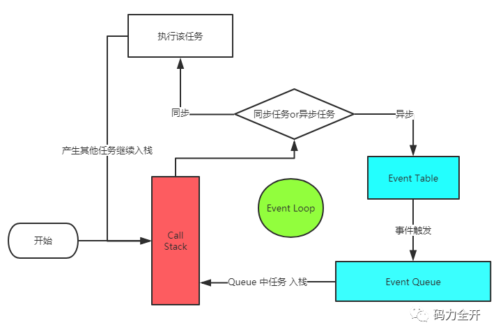

## 事件执行的机制(eventLoop)

### 1.1 问题分析

考察  js 代码的执行过程  执行顺序

### 1. 2 核心问题讲解




#### 1.2.1 Js 代码执行机制

- 所有同步任务都在主线程上的栈中执行。
- 主线程之外，还存在一个"任务队列"（task queue）。只要异步任务有了运行结果，就在"任务队列"之中放置一个事件。
- 一旦"栈"中的所有同步任务执行完毕，系统就会读取"任务队列"，选择出需要首先执行的任务（由浏览器决定，并不按序）。

#### 1.2.2 宏任务与微任务

1. MacroTask（宏观Task） **setTimeout, setInterval**, , requestAnimationFrame, I/O
2. MicroTask（微观任务） process.nextTick, **Promise**, Object.observe, MutationObserver
3. **先同步 再取出第一个宏任务执行 所有的相关微任务总会在下一个宏任务之前全部执行完毕   如果遇见 就  先微后宏**

### 1.3 问题扩展

每办理完一个业务，柜员就会问当前的客户，是否还有其他需要办理的业务。**\*（检查还有没有微任务需要处理）***
而客户明确告知说没有事情以后，柜员就去查看后边还有没有等着办理业务的人。**\*（结束本次宏任务、检查还有没有宏任务需要处理）***

**题目**

```js
console.log('1');

    setTimeout(function () {
      console.log('2');
      new Promise(function (resolve) {
        console.log('3');
        resolve();
      }).then(function () {
        console.log('4')
      })
    },0)
    new Promise(function (resolve) {
      console.log('5');
      resolve();
    }).then(function () {
      console.log('6')
    })

    setTimeout(function () {
      console.log('7');
      new Promise(function (resolve) {
        console.log('8');
        resolve();
      }).then(function () {
        console.log('9')
      })
      console.log('10')
    },0)
    console.log('11')

    // 1 5 11 6 2 3 4 7 8 10 9
    // 第一个setTimeout宏任务结束之后，会去检查队列中是否有微任务存在，如果有的话先执行微任务。（微任务优先级高）
```

### 1.4  结合项目中使用