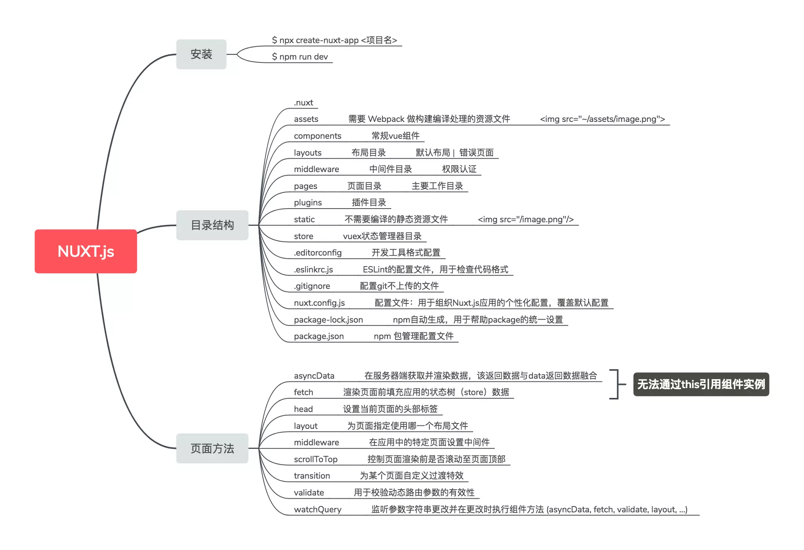

## vue做服务端渲染

nuxt

[nuxt官网文档](https://zh.nuxtjs.org/guide/installation/)

> 分析: 为什么要做服务端渲染, 首先要明白 服务端渲染解决什么问题
>
> **`解析`**: vuejs 官网说的很明白, 要做服务端渲染首先必须是有对应的需求,即对 实时到达时间(页面访问时间)的绝对需求.  如果只是简单的一个管理系统, 区区几百毫秒的优化 显得十分小题大做.
>
> 服务端渲染这里 有一个成熟优秀的框架 nuxt.js , 正如next.js对于react,nuxt是vue服务端渲染的优秀解决方案

> nuxt的出现可以让渲染内容完全服务端化,解决seo不够友好, 首屏渲染速度不够迅速的问题,
>
> 但是这里需要注意: 并不是所有页面都需要服务端渲染, 因为服务端渲染比重多大 对于服务器的访问处理能力 要求也会急剧增大

```
步骤
  1 脚手架 npx create-nuxt-app <项目名>
  2 yarn dev 启动开发
  
  上线 
  yarn build
  yarn start
```

### 为什么使用nuxt.js?

vue单页面应用渲染是从服务器获取所需js，在客户端将其解析生成html挂载于
id为app的DOM元素上，这样会存在两大问题。

1. 由于资源请求量大，造成网站首屏加载缓慢，不利于用户体验。
2. 由于页面内容通过js插入，对于内容性网站来说，搜索引擎无法抓取网站内容，不利于SEO。
   Nuxt.js 是一个基于Vue.js的通用应用框架，预设了利用Vue.js开发服务端渲染的应用所需要的各种配置。可以将html在服务端渲染，合成完整的html文件再输出到浏览器。

**除此之外，nuxt与vue还有一些其他方面的区别。**

1. **路由**
   nuxt按照 pages 文件夹的目录结构自动生成路由
   vue需在 src/router/index.js 手动配置路由
2. **入口页面**
   nuxt页面入口为 layouts/default.vue
   vue页面入口为 src/App.vue


1. **webpack配置**
   nuxt内置webpack，允许根据服务端需求，在 nuxt.config.js 中的build属性自定义构建webpack的配置，覆盖默认配置
   vue关于webpack的配置存放在build文件夹下

2. **asyncData 里面发送ajax 这个东西跟生命周期这些都是平级的**

  要理解asyncData方法执行时，其实是在服务端完成的，这个数据是在服务端渲染好了的 

  ​

  ```
  unxtjs的ajax，你先别往你那个异步上去思考，其实这里面所有的ajax最后都会形成页面。你别想着，我一点按钮，调用一个方法，然后再ajax去加载数据。因为我们最后全部都会生成静态，所以任何的获取数据的操作，最后都会变成页面的跳转。
  ```

所以，官方给了一套写法，你必须按照这个去写，
并且这里的ajax会再页面渲染之前就执行。这个东西跟生命周期这些都是平级的。


1 cnpm install @nuxtjs/axios --save
2 .plugins目录新建axios.js

```
import * as axios from 'axios'

let options ={}

//需要全路径才能工作

if(process.server){

　　options.baseURL=http://${process.env.HOST || 'localhost'}:${process.env.PORT || 3000}/api

}

export default axios.create(options)
```


3.Nuxt.config.js增加axios配置

 

```
modules:[

　　'@nuxtjs/axios'

],

```


4 使用 asyncData 里面发送ajax 这个东西跟生命周期这些都是平级的 在页面渲染之前

```
export default {

  async asyncData({app}){

　　        let res =await app.$axios({

              　　headers: { 'Content-Type': 'application/x-www-form-urlencoded' },
              　　method: 'get',
              　　url: `http://test.yms.cn/testjson.asp`,
              　　data: ''
    
        　　})
        // app.$axios
        　　console.log('res',res.data)
        　　return{
        　      　testData:res.data.title
        　　}
    },
    created(){
      console.log('nuxt reg组件')
      
    }

}

```

下图为关于nuxt的简单概述

